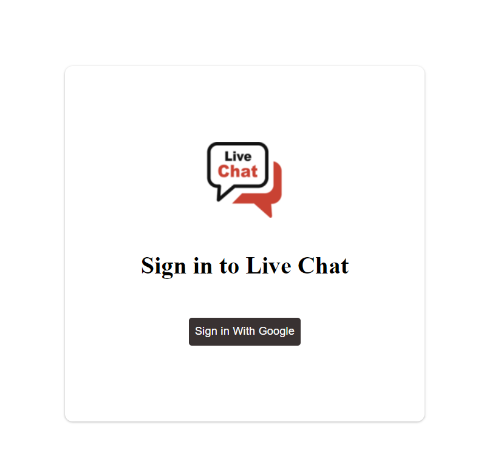

Live Site:

• Chat application, where users are able to send and receive the messages in
the realtime by login in using the google authentication.
• Multiple users can communicate with each other as it manages all the
information about chat profile, chat history and the chat application.
• Reactjs along with dependencies has been used for the implementation and
Firebase has been used for the realtime database, authentication and
hosting.

Live website link : https://chat-application-200e0.web.app/